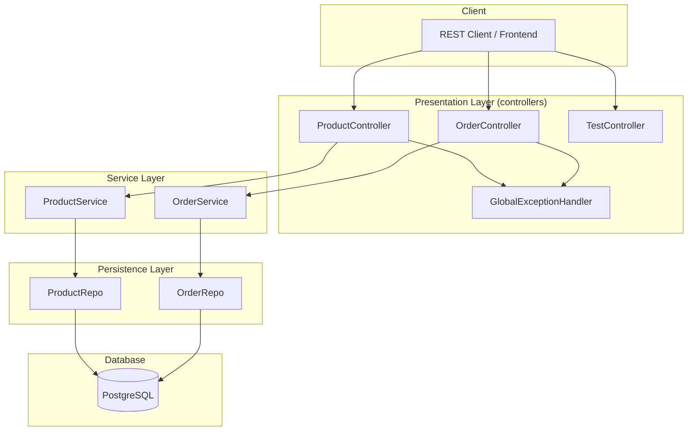
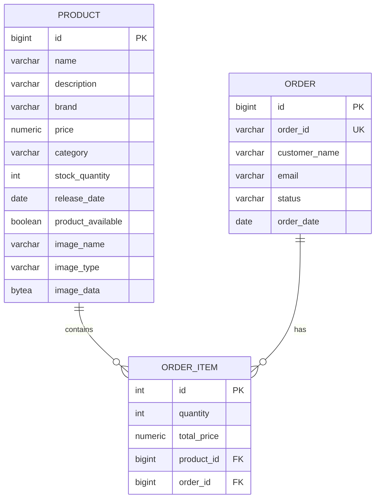
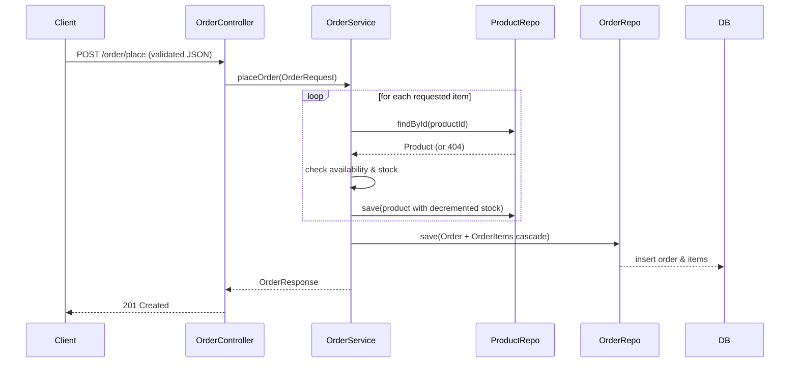
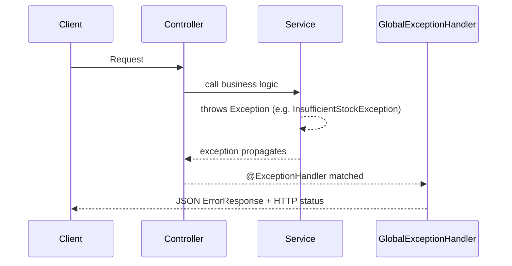

# E-Commerce API

A production-minded RESTful e-commerce backend built with Spring Boot. It manages **products** and **orders**, supports image uploads, real-time stock validation, product search, and ships with interactive API documentation out of the box.

---

## Table of Contents

1. [Tech Stack](#tech-stack)
2. [Architecture](#architecture)
3. [Project Structure](#project-structure)
4. [Data Model](#data-model)
5. [Request Flow](#request-flow)
6. [Prerequisites](#prerequisites)
7. [Configuration](#configuration)
8. [Running the Application](#running-the-application)
9. [API Reference](#api-reference)
10. [Error Handling](#error-handling)
11. [Design Decisions](#design-decisions)
12. [Testing](#testing)
13. [Deployment](#deployment)
14. [Roadmap / Suggested Improvements](#roadmap--suggested-improvements)
15. [License](#license)

---

## Tech Stack

| Layer        | Technology                                            |
|--------------|-------------------------------------------------------|
| Language     | Java 21                                               |
| Framework    | Spring Boot 4.0.6                                     |
| Web Layer    | Spring MVC (`spring-boot-starter-webmvc`)             |
| Data Access  | Spring Data JPA / Hibernate                           |
| Database     | PostgreSQL                                            |
| Validation   | Jakarta Bean Validation                               |
| API Docs     | Springdoc OpenAPI (Swagger UI)                        |
| Build Tool   | Maven (wrapper included)                              |
| Utility      | Lombok (code generation), Spring Boot DevTools        |

---

## Architecture

The application follows a **classic layered architecture**, keeping a clear separation of concerns across four tiers.

### Layered Diagram



### Layer Responsibilities

| Layer           | Package              | Responsibility                                                        |
|-----------------|----------------------|-----------------------------------------------------------------------|
| Presentation    | `controllers`        | HTTP endpoint definitions, DTO binding, response shaping              |
| Service         | `service`            | Business rules: stock checks, price calculation, transactional logic  |
| Persistence     | `repo`               | Spring Data JPA repositories, custom queries (e.g., product search)   |
| Domain          | `model`              | JPA entities (`Product`, `Order`, `OrderItem`) and request/response DTOs |
| Error Handling  | `controllers`        | `@RestControllerAdvice` mapping exceptions to HTTP responses           |

### Architectural Highlights

- **Loose coupling**: controllers never touch the database; all persistence happens through repositories called from the service layer.
- **DTO isolation**: the API surface uses records (`OrderRequest`, `OrderResponse`, `ErrorResponse`) so internal entity shapes are not leaked to clients.
- **Centralized error handling**: every exception — business, validation, or unexpected — is translated into a consistent JSON error shape by `GlobalExceptionHandler`.
- **Transaction safety**: order placement is wrapped in a single `@Transactional` boundary so stock decrements and order creation commit (or roll back) atomically.
- **Environment-driven config**: no secrets in source; database credentials come from environment variables.

---

## Project Structure

```
ecommerce/
├── pom.xml                        # Maven build definition & dependencies
├── mvnw / mvnw.cmd                # Maven wrapper scripts
├── .mvn/wrapper/                  # Wrapper configuration
└── src/
    ├── main/
    │   ├── java/com/dinesh/ecommerce/
    │   │   ├── EcommerceApplication.java        # Spring Boot entry point
    │   │   ├── controllers/
    │   │   │   ├── ProductController.java       # Product REST endpoints
    │   │   │   ├── OrderController.java         # Order REST endpoints
    │   │   │   ├── TestController.java          # Smoke-test endpoint
    │   │   │   └── GlobalExceptionHandler.java  # Centralized exception handling
    │   │   ├── service/
    │   │   │   ├── ProductService.java          # Product business logic
    │   │   │   └── OrderService.java            # Order business logic
    │   │   ├── repo/
    │   │   │   ├── ProductRepo.java             # Product persistence
    │   │   │   └── OrderRepo.java               # Order persistence
    │   │   ├── model/
    │   │   │   ├── Product.java                 # Product entity
    │   │   │   ├── Order.java                   # Order entity
    │   │   │   ├── OrderItem.java               # Order line-item entity
    │   │   │   └── dto/                         # Request/response records
    │   │   └── Exceptions/                      # Domain-specific exceptions
    │   └── resources/
    │       └── application.properties           # Configuration (env-driven)
    └── test/
        └── java/com/dinesh/ecommerce/
            └── EcommerceApplicationTests.java   # Context-load test
```

---

## Data Model

### Entity Relationships



| Entity      | Key Fields                                           | Relationships                      |
|-------------|------------------------------------------------------|------------------------------------|
| `Product`   | `name`, `price`, `stockQuantity`, `category`, image  | `1:N` to `OrderItem`               |
| `Order`     | `orderId` (unique), `customerName`, `email`, `status`| `1:N` to `OrderItem` (cascade all) |
| `OrderItem` | `quantity`, `totalPrice`                             | `N:1` to `Product`, `N:1` to `Order` |

Notes:

- `Order.orderId` is a human-friendly unique business key (e.g. `ORD1A2B3C4D`).
- `OrderItem.totalPrice` is computed as `product.price * quantity` at order time, storing a snapshot of the agreed price.
- Stock is stored on `Product` and decremented when an order is placed.

---

## Request Flow

### Order Placement (core transaction)



### Error Flow



---

## Prerequisites

- **Java 21** or later
- **Maven 3.9+** (or use the bundled `mvnw` wrapper)
- **PostgreSQL** instance

---

## Configuration

The application is configured entirely through environment variables for the database connection.

```bash
export DB_URL="jdbc:postgresql://localhost:5432/ecommerce"
export DB_USERNAME="postgres"
export DB_PASSWORD="your_password"
```

On Windows (PowerShell):

```powershell
$env:DB_URL = "jdbc:postgresql://localhost:5432/ecommerce"
$env:DB_USERNAME = "postgres"
$env:DB_PASSWORD = "your_password"
```

### Key Properties

| Property                          | Default | Description                                    |
|-----------------------------------|---------|------------------------------------------------|
| `spring.datasource.url`           | —       | JDBC URL (**required**)                        |
| `spring.datasource.username`      | —       | DB username (**required**)                     |
| `spring.datasource.password`      | —       | DB password (**required**)                     |
| `spring.jpa.hibernate.ddl-auto`   | `update`| Auto-create/update schema (dev convenience)    |
| `spring.jpa.show-sql`             | `true`  | Logs generated SQL (set `false` in production) |
| `spring.datasource.hikari.auto-commit` | `false`| Disables auto-commit; rely on `@Transactional` |

> **Production note**: replace `ddl-auto=update` with Flyway/Liquibase migrations and `ddl-auto=validate`, and disable SQL logging.

---

## Running the Application

```bash
# Linux/macOS
./mvnw spring-boot:run

# Windows
mvnw.cmd spring-boot:run
```

Build the jar and run tests:

```bash
mvn clean package
java -jar target/ecommerce-0.0.1-SNAPSHOT.jar
```

> The context-load test requires a reachable PostgreSQL instance with the environment variables above set.

---

## API Reference

Once running, interactive docs are available at:

- **Swagger UI:** `http://localhost:8080/swagger-ui.html`
- **OpenAPI JSON:** `http://localhost:8080/v3/api-docs`

### Health / Smoke Test

| Method | Endpoint  | Description            |
|--------|-----------|------------------------|
| GET    | `/test`   | Returns a text response |

### Products

| Method | Endpoint                    | Description                                  |
|--------|-----------------------------|----------------------------------------------|
| GET    | `/product/getAll`           | List all products                            |
| GET    | `/product/{id}`             | Get a product by ID                          |
| GET    | `/product/search?keyword=x` | Search name, description, brand, or category |
| POST   | `/product/add`              | Create a product (multipart)                 |
| PUT    | `/product/{id}`             | Update a product by ID (multipart)           |
| DELETE | `/product/{id}`             | Delete a product by ID                       |

#### Multipart Form (add/update)

| Part      | Type       | Required | Notes                      |
|-----------|------------|----------|----------------------------|
| `product` | JSON part  | Yes      | Product fields (validated) |
| `image`   | File part  | No       | Product image              |

Example `product` part:

```json
{
  "name": "Wireless Mouse",
  "description": "Ergonomic wireless mouse",
  "brand": "Logitech",
  "price": 1499.00,
  "category": "Electronics",
  "stockQuantity": 25,
  "releaseDate": "15-08-2026",
  "productAvailable": true
}
```

> `releaseDate` uses the `dd-MM-yyyy` format.

**cURL example — create a product:**

```bash
curl -X POST http://localhost:8080/product/add \
  -F 'product={"name":"Wireless Mouse","description":"Ergonomic wireless mouse","brand":"Logitech","price":1499.00,"category":"Electronics","stockQuantity":25,"productAvailable":true};type=application/json' \
  -F 'image=@mouse.jpg'
```

### Orders

| Method | Endpoint              | Description           |
|--------|-----------------------|-----------------------|
| POST   | `/order/place`        | Place an order        |
| GET    | `/order/getAllOrders` | List all orders       |

#### Place Order

```json
{
  "customerName": "Dinesh",
  "email": "dinesh@example.com",
  "items": [
    { "productId": 1, "quantity": 2 }
  ]
}
```

**cURL example:**

```bash
curl -X POST http://localhost:8080/order/place \
  -H "Content-Type: application/json" \
  -d '{"customerName":"Dinesh","email":"dinesh@example.com","items":[{"productId":1,"quantity":2}]}'
```

**Validation rules enforced:**

| Field          | Rule                                  |
|----------------|---------------------------------------|
| `customerName` | Not blank                             |
| `email`        | Not blank, valid email                |
| `items`        | At least one item                     |
| `productId`    | Positive                              |
| `quantity`     | At least 1                            |

Order placement also verifies the product exists, is available, and has enough stock — otherwise the transaction is rejected and rolled back.

---

## Error Handling

All errors are normalized by `GlobalExceptionHandler` into a consistent shape.

| HTTP Status | Scenario                                        |
|-------------|-------------------------------------------------|
| 400         | Bean-validation failure / bad request           |
| 404         | Resource not found (e.g., product, order item)  |
| 409         | Insufficient stock / duplicate resource         |
| 500         | Unexpected server error                         |

Standard error body:

```json
{
  "status": 404,
  "message": "Product not found with ID: 99",
  "timestamp": "2026-08-21T10:15:30"
}
```

Validation errors return a field-to-message map:

```json
{
  "email": "email must be valid",
  "items": "order must have atleast one item"
}
```

---

## Design Decisions

| Decision                        | Rationale                                                                   |
|---------------------------------|-----------------------------------------------------------------------------|
| Layered architecture            | Clear separation of web, business, and persistence concerns                  |
| Record-based DTOs               | Immutable, compact request/response contracts decoupled from JPA entities    |
| `@Transactional` order placement| Guarantees atomic stock decrement + order creation                          |
| Custom exception types          | Domain-specific exceptions (`InsufficientStockException`, etc.) map cleanly to status codes |
| `@RestControllerAdvice`         | Single place for error mapping, no scattered try/catch                      |
| Environment variables           | No credentials in source control                                            |
| Image stored as BLOB            | Simple self-contained storage (swap to object storage at scale)             |

---

## Testing

Currently the project includes a Spring context smoke test:

```
src/test/java/com/dinesh/ecommerce/EcommerceApplicationTests.java
```

**Run tests:**

```bash
mvn test
```

> **Note:** the context-load test boots the full application, so it needs PostgreSQL reachable with the environment variables configured. See the [Roadmap](#roadmap--suggested-improvements) for planned service/controller-level test coverage.

---

## Deployment

The build produces a self-contained, executable jar.

```bash
mvn clean package
java -jar target/ecommerce-0.0.1-SNAPSHOT.jar
```

It can be containerized trivially (example `Dockerfile` concept):

```dockerfile
FROM eclipse-temurin:21-jre
WORKDIR /app
COPY target/ecommerce-0.0.1-SNAPSHOT.jar app.jar
EXPOSE 8080
ENV DB_URL=jdbc:postgresql://db:5432/ecommerce
ENTRYPOINT ["java", "-jar", "app.jar"]
```

---

## Roadmap / Suggested Improvements

- **Security**: enable the (currently commented-out) Spring Security starter — add authn/authz, password hashing, and JWT session handling.
- **Migrations**: replace `ddl-auto=update` with Flyway/Liquibase and `ddl-auto=validate`.
- **Pagination & filtering**: add pageable queries to list endpoints; filter products by category and price range.
- **Order lifecycle**: order status transitions (cancel/ship/deliver), order lookup by `orderId`, and order cancellation with stock restore.
- **Stock safety**: use pessimistic locking or atomic `UPDATE ... SET stock = stock - ?` to prevent overselling under concurrency.
- **Image delivery**: serve images via a dedicated streaming endpoint instead of embedding base64 in JSON; add size/type limits.
- **Test coverage**: service/controller integration tests (MockMvc + H2/Testcontainers), plus repository tests.
- **Observability**: structured logging, metrics (Micrometer), and health/readiness probes.
- **CI/CD**: GitHub Actions pipeline for build, test, and container publish.
- **CORS**: scope `@CrossOrigin` to specific allowed origins instead of `*`.

---

## License

Proprietary / All rights reserved.